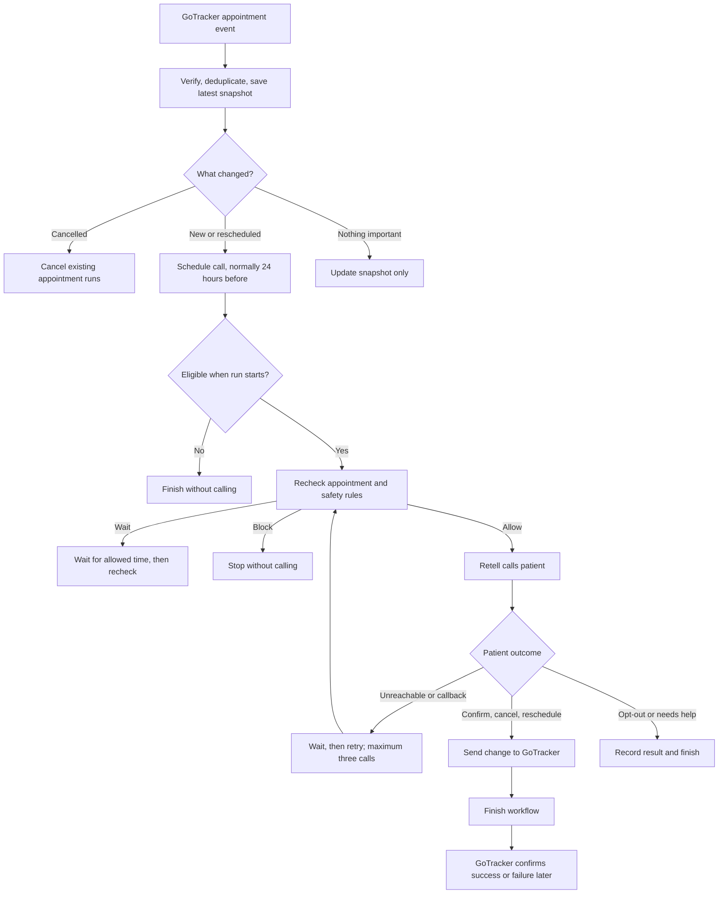

# Pre-Appointment Workflow: Current Behavior

Last checked against the code and staging logs: 2026-08-12

This is a plain-English reference for the current **Surgery Pre-Appointment
Confirmation** workflow. It explains what the system does today, including the
important edge cases. It does not assume that every current behavior is correct.

## 1. What the workflow does

The system calls a patient before an eligible surgery or major appointment. The
patient can confirm, cancel, request a new time, ask for a callback, or opt out.

- **GoTracker** owns the appointment.
- **This application** decides when to call and tracks the workflow.
- **Retell** makes the call and reports what the patient said.
- **The Synchronizer** carries changes from this application back to GoTracker.

## 2. The complete flow



### Step 1: Receive the appointment

The application accepts created, updated, and cancelled appointment events from
GoTracker. It verifies the webhook, ignores duplicates, and updates its local
appointment snapshot.

Only changes treated as coming from a human in the PMS start or cancel workflows.
Events created by this application update the snapshot but do not start another
workflow. This prevents feedback loops.

For a new or rescheduled appointment, the call is normally scheduled 24 hours
before the appointment. If that time has already passed, no run is created. A
reschedule can create a new run because runs are tied to both the appointment ID
and its scheduled time.

### Step 2: Check eligibility

At run start, both conditions must pass:

1. GoTracker status is `1` (booked).
2. The appointment's first reason exactly matches an allowed reason.

Capitalization and outer spaces are ignored. Only the first reason is checked.
These values come from the original event; they are not freshly read from
GoTracker at this stage.

An empty reason is not inherently an error. It passes only when the published
workflow configuration explicitly includes an empty value among its allowed
reasons. The 2026-08-12 staging tests intentionally used an empty reason and are
therefore not evidence of a routing defect.

### Step 3: Check again before every call

Immediately before each attempt, the workflow checks:

- whether the appointment was cancelled or moved;
- institution emergency halt;
- quiet hours;
- patient and location do-not-contact rules;
- voice consent and availability of a valid phone number; and
- whether another automated call reached the patient too recently.

Quiet hours delay the call and cause all checks to run again later. A compliance
block stops the run. Cancellation or a changed appointment time skips the call.

The workflow treats this as a transactional care call. A usable care phone number
counts as implied voice consent unless consent was revoked or a do-not-contact
rule matches.

### Step 4: Call the patient

Retell places the call. The application records the attempt before sending the
request so a worker crash does not accidentally dial twice.

The workflow then waits for Retell's analyzed result. A 30-minute safety timeout
prevents the run from waiting forever, and a background poller tries to recover
missed Retell webhooks.

## 3. What each result does

Exact Retell outcome names matter; unexpected spelling falls into the fallback
path.

| Patient/call result | Current action |
| --- | --- |
| Confirmed | Send `confirmed: true` to GoTracker and finish as confirmed. |
| Cancelled | Send `status_id: 3` to GoTracker and finish as cancelled. |
| Reschedule with a valid new time | Change only the same appointment's start time and finish as rescheduled. |
| Reschedule without a time | Record a local “missing time” result; no GoTracker change or real staff task. |
| Callback with a time on attempt 1 or 2 | Wait until that time, then use the next call attempt. |
| Callback on attempt 3 | Record `callback_requested_after_max_attempts` locally and finish; no fourth call is added. |
| Callback without a time | Record a local “missing time” result; no real staff task. |
| No answer, voicemail, busy, declined, or timeout | Retry if an attempt remains; otherwise record unreachable. |
| Do not call | Record the opt-out and, when possible, add a location-level do-not-contact rule. |
| Technical failure, `failed`, or any other unexpected result | Record `pre_appointment_followup_needed` locally and finish with the `staff_handoff` outcome label. There is no automatic retry and no owned staff task is created. |

There are at most three calls. The default delays after attempts one and two are
five hours. A callback uses the next available attempt; it does not add a fourth
attempt. Quiet hours are checked again before every retry or callback.

A past callback time runs immediately. A malformed but non-empty callback time
also currently falls back to “now.” There is no rule preventing a callback from
being scheduled after the appointment.

## 4. Staging verification of the five patient paths

The following calls were checked in the staging Retell, workflow-worker, API, and
Synchronizer logs on 2026-08-12. The run IDs are shortened only for readability.

| Case | Workflow run / Retell call | Condition and resulting path | Observed GoTracker activity |
| --- | --- | --- | --- |
| Confirm | `a62ac156` / `call_adf1bb5359065b1480837bca123` | `call_outcome == confirmed` -> `write-gotracker-confirmed` -> completed as `appointment_confirmed` | `PATCH /api/appointments/1414/status` returned `200`; payload requests `confirmed: true`. |
| Cancel | `c5fe08ea` / `call_009190eb37cea435485b701fbde` | `call_outcome` was a cancellation value -> `write-gotracker-cancelled` -> completed as `appointment_cancelled` | `PATCH /api/appointments/1415/status` returned `200`; payload requests `status_id: 3`. A returning `appointment.cancelled` event was handled as projection-only. |
| Reschedule | `f5b9c4c4` / `call_dfe850ac659aa5e4d6363dcdc3d` | `call_outcome == reschedule_requested` and `reschedule_start_time` was present -> `write-gotracker-rescheduled` -> completed as `appointment_rescheduled` | `PATCH /api/appointments/1416` returned `200`; only `start_time` was changed. A returning `appointment.updated` event was handled as projection-only. |
| Callback | `d78ccf89` / `call_59d339dfd6a40aa399f312dec89` | `call_outcome == callback_requested` and `callback_at` was present -> `wait-callback-1` | Run remained `waiting` until the requested time. No GoTracker appointment update was sent. |
| No answer | `7588a719` / `call_9f47873e8d0612a465fcffc66f5` | `call_outcome == no_answer` -> `wait-retry-1` | Run remained `waiting` for the configured five-hour retry. No GoTracker appointment update was sent. |

These five tests prove the outcome routing and first-attempt behavior. The two
waiting runs still need their later attempts to test attempt 2/3 exhaustion,
callback-on-final-attempt behavior, and the final unreachable status.

## 5. When an appointment is changed

Confirmation, cancellation, and rescheduling pass through three stages:

1. The Synchronizer accepts the HTTP request. In these tests it returned `200`.
2. The workflow immediately reports success and records a pending writeback.
3. GoTracker later confirms success or failure through a callback. If that
   callback is lost, the five-minute sweeper reads the appointment and resolves
   the pending writeback.

If GoTracker later rejects the change, the writeback is marked failed, but the
already completed workflow is not reopened or corrected.

Rescheduling changes only `start_time`. It does not update end time, duration,
provider, operatory, reason, confirmation, or status. Only one pending change is
allowed for an appointment at a time.

A background check reviews writebacks still pending after five minutes and
compares them with the current GoTracker appointment. Returning GoTracker events
created by this application update the local projection but are not allowed to
start a feedback loop.

## 6. External cancellation, rescheduling, and controls

- A cancellation from GoTracker cancels known runs and workflow timers.
- A GoTracker reschedule cancels waiting runs for the old time and schedules the
  new time. A run already executing is deliberately not cancelled to avoid a race.
- Initial scheduled jobs exist before the workflow run exists. They cannot be
  directly cancelled, but should later stop after seeing the newer appointment.
- A normal workflow pause blocks new triggers and delays durable timers. It does
  **not** reliably stop an already queued initial job or a Retell result that is
  already waiting to resume.
- Emergency halt cancels active runs and blocks new calls. It is the stronger
  safety control.

## 7. Important current weaknesses to review

These are the main places where the CTO should confirm the intended product
policy or request a change:

1. **Success may be premature.** The workflow says confirmed, cancelled, or
   rescheduled before GoTracker gives final confirmation.
2. **Freshness can fail open.** Eligibility uses captured event data. If the local
   appointment snapshot is stale, the shared live check uses a NexHealth-oriented
   reader rather than a GoTracker adapter; some read failures allow the call.
3. **Some “staff handoffs” are only labels.** Missing callback/reschedule times,
   exhausted attempts, technical failures, and unexpected outcomes do not create
   a real owned task in this workflow.
4. **Reschedule data can be incomplete.** Only start time is changed, and the new
   run can be created without the status/reason metadata needed for eligibility.
5. **Pause is not a full freeze.** Already queued work or a parked call result may
   continue and can reach a GoTracker writeback.
6. **Callback validation is weak.** Invalid times can become immediate, and times
   after the appointment are accepted.
7. **Outcome spelling controls care actions.** Retell values are not normalized
   into a strict versioned contract before routing.
8. **Consent policy needs approval.** Implied consent for transactional voice
   calls must be valid for every clinic and jurisdiction.
9. **Displayed frequency caps are not the real limit.** Appointment enrollment
   relies mainly on the configured voice cooldown; the displayed daily and
   seven-day caps are not enforced here.
10. **Timeout records are not fully consistent.** A safety-timeout or poller-only
    recovery may leave different attempt, response, or call records than the
    normal Retell webhook path.

## 8. Main implementation references

The behavior above was checked primarily against:

```text
src/app/services/automation/campaign_templates.py
src/app/services/automation/appointment_trigger_service.py
src/app/services/automation/enrollment_service.py
src/app/services/automation/step_dispatcher.py
src/app/services/automation/revalidation.py
src/app/services/automation/voice_node_executor.py
src/app/services/automation/gotracker_writeback_service.py
src/app/tasks/automation_workflow.py
src/app/api/routes/gotracker_webhooks.py
src/app/retell/webhooks.py
```
